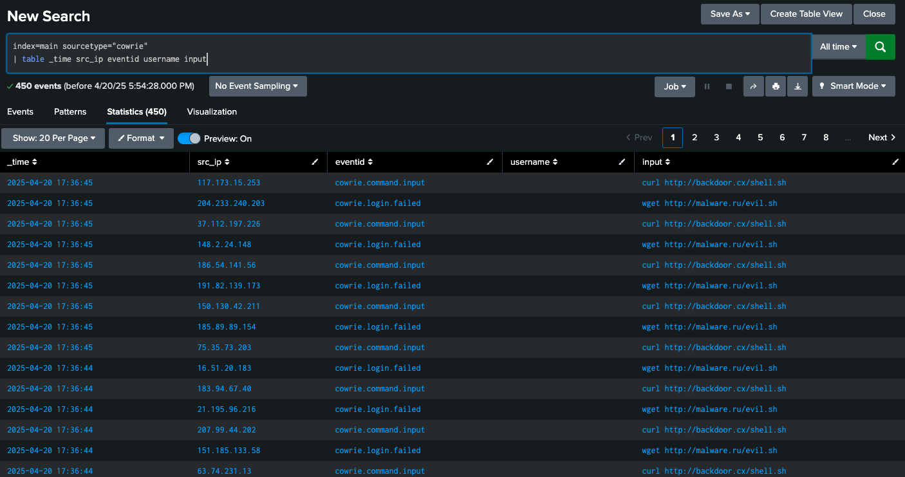
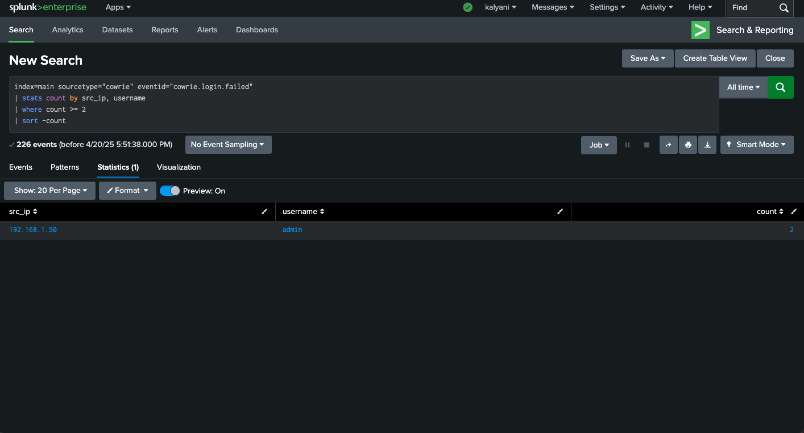
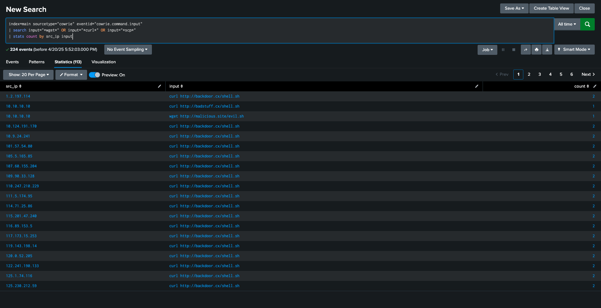

## Cowrie Threat Detection Lab (Splunk SIEM)

This lab simulates SSH brute force attacks and malicious command inputs using Cowrie honeypot-style logs. The logs are injected into Splunk via HEC, and detections are written using SPL to identify adversarial activity.

## Project Goals

- Emulate real-world SSH attacks
- Detect brute force and payload download behaviors
- Simulate Blue Team alerting and investigation
- Show detection engineering in Splunk

## What’s Included

- Python script to send logs to Splunk
- Cowrie-style mock JSON data
- SPL detections:
  - Brute force login detection
  - Malicious command input detection

## Architecture Overview

- Cowrie SSH honeypot (simulated log format)
- Filebeat-style configuration (mocked forwarding)
- Splunk SIEM ingestion via HTTP Event Collector
- Python log injector script
- Custom SPL detections and dashboards

---

## MITRE ATT&CK Mapping

| Technique ID | Technique Name | Description |
|--------------|----------------|-------------|
| T1110.001 | Brute Force | SSH login attempts using password guessing |
| T1059.003 | Command-Line Interface | Shell commands like `wget` and `curl` |
| T1105 | Ingress Tool Transfer | File download activity from remote URLs |

---

## Detection Rules

| Rule | Description |
|------|-------------|
| `ssh-brute-force.spl` | Detects repeated failed login attempts |
| `suspicious-downloads.spl` | Detects use of `wget` or `curl` in honeypot sessions |

---

## Lessons Learned

- Honeypots are valuable for understanding real attacker behavior
- Simulated log analysis is effective for blue team practice
- SPL detection writing shares many parallels with coding logic
- Presentation and documentation matter as much as engineering

---

## 📸 Detection Screenshots

### Raw Cowrie Logs


### Brute Force Attempt Detection


### Suspicious Download Commands



---

## Local Testing Instructions

To simulate a live attack log feed and test detection logic:

```bash
python3 inject_logs.py

```

## Make sure
- Splunk HEC is enabled and listening on port 8088
- Authorization token is correctly set in the script
- Log file cowrie.json exists in the project root

## Certifications and Skills Demonstrated
  - CompTIA CySA+
  - Splunk Fundamentals 1
  - MITRE ATT&CK knowledge
  - Detection engineering
  - Python scripting for log transport
  - Use of GitHub for project versioning and documentation
